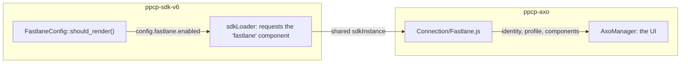

# Fastlane

`modules/ppcp-axo` renders the whole Fastlane UI: the email lookup, the watermark, the card form and the profile selectors. This module decides whether to request the SDK component and hands the resulting object over. Fastlane is an identity and authentication API rather than a button, so it has no session or web-component equivalent to the other methods.

## Gating

[`FastlaneConfig`](https://github.com/woocommerce/woocommerce-paypal-payments/blob/dev/develop/modules/ppcp-sdk-v6/src/Helper/FastlaneConfig.php) answers whether the `fastlane` component should be requested on this page, gating both the SDK component list and the `fastlane` subtree of the script config. It requires all of:

- the context is `checkout` or `checkout-block`;
- the visitor is not logged in, since Fastlane recognises returning guests;
- advanced card processing and the Fastlane method are both enabled;
- the cart holds no subscription, which needs a vaulted method this flow does not produce;
- the merchant is eligible on country, currency, filter and gateway state.

It mirrors `AxoApplies::should_render_fastlane()` without that method's classic-checkout clause, which would refuse the block checkout this module also serves. Called before `wp_loaded` it returns false with a `_doing_it_wrong()`: the subscription check reads the cart, and a cart WooCommerce has not loaded yet looks empty.

The eligibility callable is composed in `services.php` from the `ppcp-axo` services, so the eligibility rules are not duplicated here.

## Taking Fastlane off the instance

[`Connection/Fastlane.js`](https://github.com/woocommerce/woocommerce-paypal-payments/blob/dev/develop/modules/ppcp-axo/resources/js/Connection/Fastlane.js) selects the SDK generation, so neither caller (`AxoManager` and the block's `useFastlaneSdk`) has to know which one backs Fastlane. The v6 branch awaits `loadSdkV6()` and calls `sdkInstance.createFastlane( config )`, sharing one instance and one client token with the buttons and card fields already on the page.

`config` carries `locale`, `styles`, `cardOptions.allowedBrands` and `shippingAddressOptions.allowedLocations`. PayPal documents the call as taking no arguments; the shipped bundle accepts the argument as `fastlaneOptions` and forwards it, so those restrictions take effect and dropping the argument would lose them. `createFastlane()` throws immediately when the instance has no client token.

Both branches end in `init()`, which copies five members off the connection:

| Member                       | Used for                                                 |
|------------------------------|----------------------------------------------------------|
| `identity`                   | `lookupCustomerByEmail()`, `triggerAuthenticationFlow()` |
| `profile`                    | `showShippingAddressSelector()`, `showCardSelector()`    |
| `FastlaneCardComponent`      | The card form                                            |
| `FastlanePaymentComponent`   | The member's stored payment method                       |
| `FastlaneWatermarkComponent` | The Fastlane watermark                                   |

The components are async factories returning an object with `render( selector )`, so a render is two awaits deep: `( await fastlane.FastlaneWatermarkComponent( { ... } ) ).render( selector )`.

None of those five names appear in PayPal's `fastlane` bundle. The component is a wrapper that lazy-loads Braintree's Fastlane script from `js.braintreegateway.com`, and the members come from there, so a blocked or failing Braintree host breaks Fastlane with nothing on the PayPal side to explain it.

## Debugging

- **No Fastlane and no error.** Read `config.fastlane.enabled`; a `false` is a `FastlaneConfig` verdict, and the list above says which condition to check.
- **`createInstance()` rejects with Fastlane requested.** It needs `clientMetadataId`.
- **The component renders nothing.** The component's name in the bundle is `fastlane`, and an unregistered custom element renders 0x0 with no console error. Check `customElements.get( 'fastlane' )`.
- **Every method disappears, Fastlane included.** An instance-level failure rather than a Fastlane one; read the client token's scope, per [SDK loading](sdk-loading.md).

---

Related: [SDK loading](sdk-loading.md)
