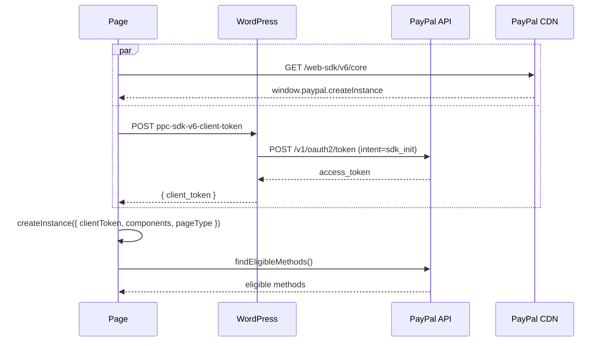

# SDK loading

A page loads the core bundle, fetches a client token, and calls `createInstance()`. Everything else in the module depends on the instance that produces.

## The handshake

The script load and the token request are independent, so [`sdkLoader.js`](https://github.com/woocommerce/woocommerce-paypal-payments/blob/dev/develop/modules/ppcp-sdk-v6/resources/js/sdkLoader.js) issues both at once and builds the instance when they land.



Every renderer awaits the same instance promise, so a failure at either step removes all v6 buttons on the page at once rather than one of them.

The core URL is `https://www.sandbox.paypal.com/web-sdk/v6/core` or `https://www.paypal.com/web-sdk/v6/core`, chosen by the environment in `SdkV6Manager::script_data()`.

## The client token

[`SdkClientToken`](https://github.com/woocommerce/woocommerce-paypal-payments/blob/dev/develop/modules/ppcp-api-client/src/Authentication/SdkClientToken.php) mints it server-side, so the merchant secret stays out of the browser:

```
POST /v1/oauth2/token
  ?grant_type=client_credentials
  &response_type=client_token
  &intent=sdk_init
  &domains[]=<home_url() host, www. stripped>
```

The token arrives in the response's `access_token` field, which does not change name when `response_type=client_token` is requested.

Four behaviours of that class:

- The cache key includes the domain, because a token is only valid for the domains it was minted for.
- A connection error is retried once before the cool-down arms, so a single network blip does not lock out token requests.
- A failure arms a cool-down keyed on `sdk-client-token`; requests during it throw instead of reaching PayPal.
- The domain comes from `home_url()`, not the request host, so a site whose `home_url()` disagrees with the host the buyer is on fails domain validation.

[`ClientTokenEndpoint`](https://github.com/woocommerce/woocommerce-paypal-payments/blob/dev/develop/modules/ppcp-sdk-v6/src/Endpoint/ClientTokenEndpoint.php) exposes it behind a nonce and a [`RateLimiter`](https://github.com/woocommerce/woocommerce-paypal-payments/blob/dev/develop/modules/ppcp-sdk-v6/src/Helper/RateLimiter.php) of 10 requests per 60 seconds, keyed on the WooCommerce session customer id and falling back to the IP. PayPal errors are logged with detail and answered with a generic message.

### Token scope

`intent=sdk_init` is a request, not a guarantee. On some merchant account and authentication combinations it is ignored and the response is a vault-scoped token whose only scope is `https://uri.paypal.com/services/vault/payment-tokens/read Braintree:Vault`. `createInstance()` accepts such a token; `findEligibleMethods()` then fails with `403 NOT_AUTHORIZED` and every button disappears.

Onboarding the merchant through OAuth rather than manually entered API keys produces a usable token, as does a different sandbox merchant. Read the token's `scope` before investigating the eligibility call; the [test page](payment-test.html) prints it.

## The component list

No payment code loads by default. `createInstance()` assembles `components` from what the page needs:

| Component               | Requested when                                  |
|-------------------------|-------------------------------------------------|
| `paypal-payments`       | Always                                          |
| `venmo-payments`        | Always                                          |
| `card-fields`           | `config.card_fields.enabled`                    |
| `paypal-guest-payments` | `config.card_button.enabled`                    |
| `fastlane`              | `config.fastlane.enabled`                       |
| `paypal-messages`       | `config.messages.enabled`                       |
| `googlepay-payments`    | Google Pay enabled, via `methodSdkComponents()` |
| `applepay-payments`     | Apple Pay enabled, via `methodSdkComponents()`  |

The wallet entries come from [`methodRegistry`](https://github.com/woocommerce/woocommerce-paypal-payments/blob/dev/develop/modules/ppcp-sdk-v6/resources/js/methods/methodRegistry.js), so adding a wallet does not mean editing the loader.

An `isEligible()` call for a component that was not requested throws rather than returning false, which is why [`eligibility.js`](https://github.com/woocommerce/woocommerce-paypal-payments/blob/dev/develop/modules/ppcp-sdk-v6/resources/js/eligibility.js) wraps the optional methods in `isEligibleSafely()`.

Component names in PayPal's published documentation do not always match the shipped bundle, and an unregistered custom element renders 0x0 with no console error. The bundles are readable JavaScript, and each declares its real name as `componentName`:

```
curl -s https://www.sandbox.paypal.com/web-sdk/v6/core
curl -s https://www.sandbox.paypal.com/web-sdk/v6/fastlane
```

The core bundle carries only `createInstance()` and `findEligibleMethods()`. Session factories and session methods live in their component's own bundle, so grepping core for `createGooglePayOneTimePaymentSession` finds nothing.

## The remaining instance arguments

- `pageType` is PayPal's vocabulary: `product` maps to `product-details`, `pay-now` and `checkout-block` to `checkout`, and anything unrecognised falls back to `checkout`.
- `locale` is the WordPress locale with the underscore replaced, so `de_DE` becomes `de-DE`.
- `clientMetadataId` is a per-page UUID PayPal correlates with the order for fraud checks. `createInstance()` rejects when the `fastlane` component is requested without one.

## One instance per page

`loadSdkV6()` memoizes the instance promise on `window.__ppcpV6InstancePromise`, and [`loadScript()`](https://github.com/woocommerce/woocommerce-paypal-payments/blob/dev/develop/modules/ppcp-sdk-v6/resources/js/utils/scriptLoaders.js) memoizes per-URL promises on `window.__ppcpV6ScriptPromises`. Module scope would not do: each webpack bundle gets its own copy of the module, and the `ppcp-axo` bundle asking for Fastlane has to reuse the instance this module's bootstrap created, or the SDK script loads twice and its custom elements fail to register.

Both caches clear their entry on failure so a retry can insert a fresh tag. A second caller of a failed load therefore sees the original error rather than a new attempt.

Once the instance exists, `ppcp-sdk-v6-ready` fires once on `document` with the instance in `detail.sdkInstance`.

## Reading the config

`window.wc_ppcp_sdk_v6` holds the config on classic pages. `SdkV6Manager::enqueue()` skips block pages, which receive the same payload through `V6PaymentMethod::get_payment_method_data()` under `wcSettings`. Read it through [`sdkV6Config()`](https://github.com/woocommerce/woocommerce-paypal-payments/blob/dev/develop/modules/ppcp-sdk-v6/resources/js/utils/config.js) rather than the global, or the code sees no v6 on half the surfaces.

## Page ownership

Only one SDK generation may run on a page, because both claim `window.paypal`. `SdkV6Manager::should_load_on_current_page()` decides, and where it returns true [`extensions.php`](https://github.com/woocommerce/woocommerce-paypal-payments/blob/dev/develop/modules/ppcp-sdk-v6/extensions.php) swaps `button.smart-button` for `DisabledSmartButton`, which empties the legacy config and silences the legacy surfaces on that page. The handoff is migration scaffolding; the end state is one flag selecting the stack for the whole flow.

---

Related: [3D Secure](three-d-secure.md), [Fastlane](fastlane.md), [Wallets](wallets.md)
