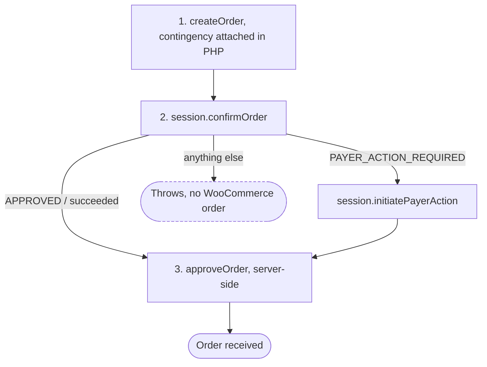

# 3D Secure

The 3D Secure contingency is decided in PHP and travels on the create-order request. This module contributes only the payer-action fork at the end of a payment; there is no other 3D Secure code in it.

## Where the value comes from

`SettingsModel::get_three_d_secure_enum()` maps the stored setting to the API enum:

| Setting                   | API enum            |
|---------------------------|---------------------|
| `no-3d-secure`            | `NO_3D_SECURE`      |
| `only-required-3d-secure` | `SCA_WHEN_REQUIRED` |
| `always-3d-secure`        | `SCA_ALWAYS`        |

An unrecognised value maps to `SCA_WHEN_REQUIRED`.

The card fields, Google Pay and vaulted-charge paths read it through `SettingsProvider::three_d_secure_enum()` and pass it through a filter, which is how an extension overrides the contingency for those methods:

```php
apply_filters( 'woocommerce_paypal_payments_three_d_secure_contingency', $settings->three_d_secure_enum() )
```

Only `SCA_ALWAYS` and `SCA_WHEN_REQUIRED` produce a request attribute. `NO_3D_SECURE`, and any unexpected value a filter returns, is expressed by omitting `attributes.verification` rather than by sending a value.

## Which methods send it

The value reaches PayPal as `payment_source.<method>.attributes.verification.method`, attached by each method's own callback on the `ppcp_create_order_request_body_data` filter.

| Method                   | Sends a contingency | Where                                                                           |
|--------------------------|---------------------|---------------------------------------------------------------------------------|
| Advanced card fields     | Yes                 | `CardFieldsModule`, matching `CreditCardGateway::ID`                            |
| Google Pay               | Yes                 | `GooglepayModule`, matching the gateway or `funding_source` `googlepay`         |
| Fastlane                 | Yes                 | `AxoGateway::build_payment_source_properties()`, alongside the single-use token |
| Vaulted card charge      | Yes                 | `CaptureCardPayment`, at capture time rather than create time                   |
| Apple Pay                | No                  | `ApplepayModule` sends only `experience_context`                                |
| PayPal, Venmo, Pay Later | Not applicable      | Authentication happens inside PayPal's own flow                                 |

With a contingency set, Fastlane also adds a `transaction_context.soft_descriptor` of "Card verification hold". PayPal documents a second path for Fastlane 3D Secure through the `three-domain-secure` SDK component and `ThreeDomainSecureClient`; this plugin uses the Orders API path instead, so no such component is requested.

Apple Pay payments are authenticated on the device and arrive as a network token, so there is no card for an issuer to challenge.

Google Pay's matcher tests both the gateway id and the funding source. A Google Pay payment from an express button belongs to the PayPal gateway, so the `funding_source` half is what matches there. The spelling has to be the one the endpoints expect, which `methodFundingSource()` in [`methodRegistry`](https://github.com/woocommerce/woocommerce-paypal-payments/blob/dev/develop/modules/ppcp-sdk-v6/resources/js/methods/methodRegistry.js) owns: Apple Pay answers to the underscored `apple_pay`, and an express order that misses the spelling loses its whole `payment_source`.

A charge against a saved card requests 3D Secure as well, because issuers that mandate Strong Customer Authentication reject such captures without it.

## The payer-action fork

When PayPal requires authentication, `confirmOrder()` reports `PAYER_ACTION_REQUIRED` instead of an approval. [`payWithSession()`](https://github.com/woocommerce/woocommerce-paypal-payments/blob/dev/develop/modules/ppcp-sdk-v6/resources/js/methods/sessionPayment.js) handles it:



No second `confirmOrder()` follows the payer action. The server-side approval in step 3 validates the resulting order state, so a challenge the buyer failed or abandoned is caught there.

The session types report success differently: the Google session reports `status: APPROVED`, the Apple one leaves the mutation name on the payload as `approveApplePayPayment`, and the card session reports `state: succeeded`. `confirmedStatus()` absorbs all three.

## Error codes

The `googlepay-payments` bundle carries its own 3D Secure error codes:

| Code                                            | Means                                             |
|-------------------------------------------------|---------------------------------------------------|
| `ERR_FLOW_PAYER_ACTION`                         | The payer action itself went wrong                |
| `ERR_FLOW_UNABLE_TO_CONSTRUCT_PAYER_ACTION_URL` | No usable challenge URL came back on the order    |
| `ERR_FLOW_EMPTY_CONTINGENCY_RESPONSE`           | PayPal returned an empty contingency response     |
| `ERR_FLOW_IFRAME_NO_CONTENT_WINDOW`             | The challenge iframe never got a content window   |
| `ERR_FLOW_CONFIRM_ORDER`                        | `confirmOrder()` failed, with the reason appended |

`ERR_FLOW_IFRAME_NO_CONTENT_WINDOW` points at the environment rather than the contingency: an ad blocker, a `Content-Security-Policy` missing `frame-src https://*.paypal.com`, or a challenge window the buyer closed.

## Sandbox behaviour

With **always** selected and an ordinary test card, sandbox opens the challenge window and confirms it without input. PayPal's published step-up card numbers expire periodically, and an expired one produces a payment error rather than a challenge; check the number against PayPal's current documentation before treating it as a plugin failure.

To confirm the attribute left the store, run the flow on the [test page](payment-test.html), which logs the `payment_source` it sends, or read the create-order request in the PayPal request log.

---

Related: [SDK loading](sdk-loading.md), [Wallets](wallets.md)
