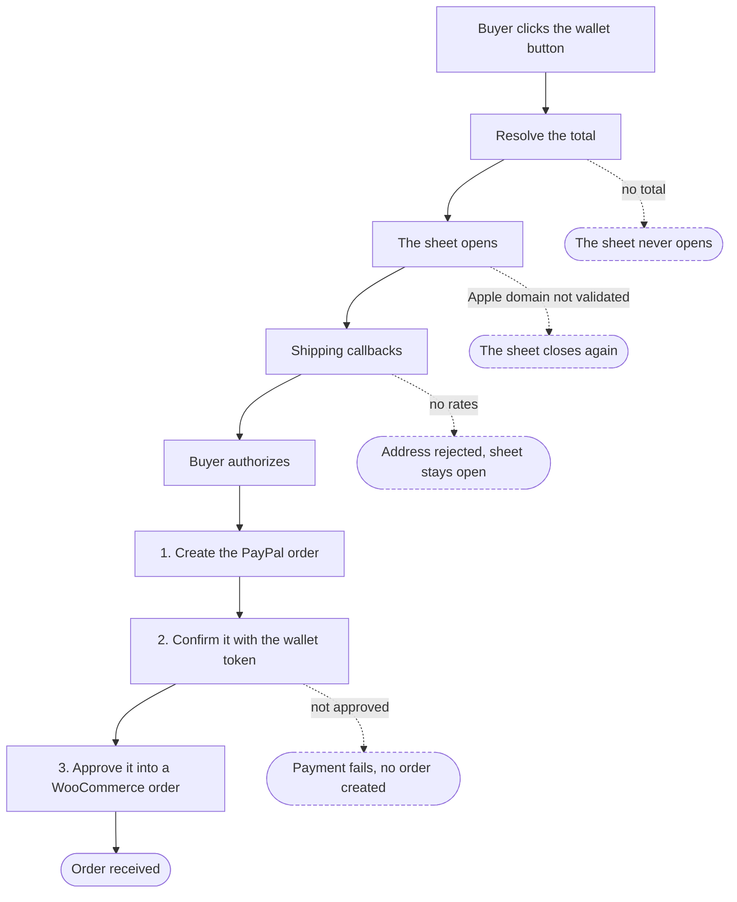

# Wallets

Apple Pay and Google Pay in the v6 SDK integration.

Both are **merchant-presented** wallets: PayPal opens no popup and runs no approval flow of its own, so the store builds the payment sheet, drives it, and reports the outcome back. Everything below follows from that.

## What has to be true for a button to appear

The following conditions, all of them required, checked in different places:

1. **The merchant is eligible for the wallet.** Country, currency, and the state of the PayPal account. The v6 module never judges this itself, it asks the wallet's own module, so the answer is the same one v5 would get.
2. **The wallet is enabled in the settings for that location.** Each location has its own styling and its own list of shown payment methods, and a wallet absent from that list does not render there.
3. **A live eligibility call includes it.** [`checkEligibility()`](https://github.com/woocommerce/woocommerce-paypal-payments/blob/dev/develop/modules/ppcp-sdk-v6/resources/js/eligibility.js) asks the SDK through `findEligibleMethods()` on every page load, with the page's currency, country and amount. A wallet can be eligible on one page and not the next.
4. The device has to support the wallet. [Google Pay](https://github.com/woocommerce/woocommerce-paypal-payments/blob/dev/develop/modules/ppcp-sdk-v6/resources/js/wallets/googlePay.js) asks before rendering and removes its button when the answer is no; [Apple Pay](https://github.com/woocommerce/woocommerce-paypal-payments/blob/dev/develop/modules/ppcp-sdk-v6/resources/js/wallets/applePay.js) asks before loading anything at all, so an unsupported browser touches neither the SDK nor the DOM.

Condition 3 and 4 cause wallet buttons to appear with a short delay after loading the page; they are not present in DOM on page load.

## Where the button ends up

Two placements, decided by the page rather than by the wallet:

- **A payment-method row of its own**, on classic checkout and pay for order. The row is printed hidden and revealed once the browser confirms it can pay, and while it is selected the wallet button stands in for "Place order". [`gatewayPlacement`](https://github.com/woocommerce/woocommerce-paypal-payments/blob/dev/develop/modules/ppcp-sdk-v6/resources/js/wallets/gatewayPlacement.js) keeps those controls mutually exclusive.
- **An express button**, everywhere else: product page, cart, mini cart, and the express area of the cart and checkout blocks.

On the block surfaces the wallet is a WooCommerce Blocks express payment method, registered in [`checkout-block.js`](https://github.com/woocommerce/woocommerce-paypal-payments/blob/dev/develop/modules/ppcp-sdk-v6/resources/js/checkout-block.js) under the wallet's own gateway id, which is also the name a merchant's saved arrangement of the express buttons refers to. React owns the container and nothing else: [`V6BridgeContainer`](https://github.com/woocommerce/woocommerce-paypal-payments/blob/dev/develop/modules/ppcp-sdk-v6/resources/js/blocks/V6BridgeContainer.js) hands an empty element to the same bridge the classic pages use, so there is one Apple Pay implementation and one Google Pay implementation rather than a second pair for blocks.

What a block surface knows better than the page did is passed to the bridge as overrides: the block's own height and corner radius, the shipping requirement read live from the React cart, and — for Apple Pay, which can await nothing inside its click handler — readers over the block's cart total and the address the shopper already entered.

Two signals go back the other way. `onUnavailable()` is a verdict: this browser or this merchant cannot pay by this wallet, so the express row goes. A render that merely threw on the way to the button reports `onRenderFailed()` instead and is retried a few times before the row is given up, because a blocked script host is not the same as an incapable browser. The container also answers `isObsolete()`, which the bridges ask after each await, so a render the surface has already torn down stops rather than appending a button nobody is waiting for.

Neither wallet can vault, so neither is offered where the purchase would have to be saved. The block registration declares the wallet's *own* gateway supports rather than PayPal's, which is what keeps the buttons off a cart that grows a subscription after the page loaded.

A wallet payment on a block surface finishes the way it does on the classic cart: the sheet collected the address, the server creates the WooCommerce order, and the buyer lands on the order-received page. The block checkout form is never submitted, because by then there is nothing left for it to contribute.

## The payment sequence

The shipping callbacks fire once per address or shipping-option change, so the middle of the diagram repeats as often as the buyer edits the sheet. The three numbered steps are [the store's own](https://github.com/woocommerce/woocommerce-paypal-payments/blob/dev/develop/modules/ppcp-sdk-v6/resources/js/wallets/sessionPayment.js). Only the last one creates anything in WooCommerce, which is why a failure before it leaves no order behind. The sheet's own state differs by wallet: Apple keeps it open until the outcome is reported back, while Google's closes the moment the buyer authorizes.

Cancelling is not a failure. The sheet closes, the payment records are released, and the page is left as it was.

[Failures](https://github.com/woocommerce/woocommerce-paypal-payments/blob/dev/develop/modules/ppcp-sdk-v6/resources/js/utils/errorHandler.js) split by who can act on them. A message the server marked shopper-facing is shown in the sheet, so the buyer can correct something and try again. Anything else is internal and the buyer sees the wallet's own wording instead, since a technical detail gives them nothing to act on.

## How the two wallets differ

The shipping and pricing behavior is identical, and the per-wallet files translate sheet protocols and nothing more. What differs is what each platform's own SDK asks of the store, and each wallet loads that SDK separately from the PayPal one: a wallet whose script fails to load simply does not render.

### Apple Pay

- **The session is built synchronously inside the click handler.** Nothing may be awaited before the sheet opens, so anything the sheet needs must already be resolved.
- **[Merchant-domain validation](https://github.com/woocommerce/woocommerce-paypal-payments/blob/dev/develop/modules/ppcp-sdk-v6/resources/js/wallets/applePayValidation.js) is the store's job.** The sheet asks mid-payment and the store answers from PayPal.
- **The buyer's street arrives only at authorization.** The shipping callbacks carry a [redacted address](https://github.com/woocommerce/woocommerce-paypal-payments/blob/dev/develop/modules/ppcp-sdk-v6/resources/js/wallets/walletContacts.js), which is enough to resolve a shipping zone but not to complete an order.
- **The button is a real custom element.** Apple's SDK registers `<apple-pay-button>`, so the bridge creates one and styles it through attributes and CSS custom properties.

### Google Pay

- **Anything may be awaited before the sheet opens**, and there is no merchant-validation step to answer.
- **The button ignores its container unless told twice.** `buttonSizeMode: 'fill'` sizes it through a `width: 100%` rule, but Google's own stylesheet also sets `min-width: 240px` on the same element, which wins and overflows a narrow column such as the blocks express row. The bridge clears that minimum inline after creating the button.
- **There is no `<google-pay-button>`.** `pay.js` ships only the imperative `PaymentsClient`, whose `createButton()` hands back a plain `div` that Google styles itself, so the two wallets leave very different markup behind. A web component does exist as a separate package, but it only wraps the same client and would put a second script on the page for the same button.

---

Related: [Wallet: Shipping and tax](wallet-shipping-and-tax.md)
