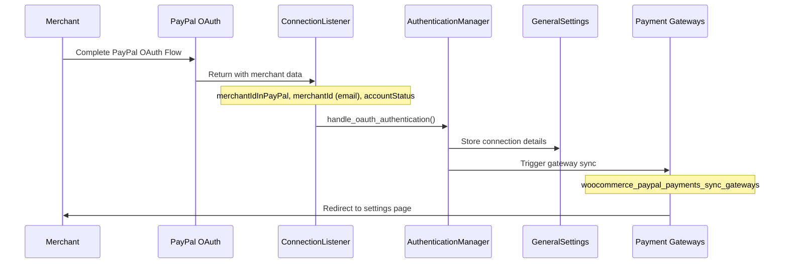

# Post-Onboarding: Merchant Connected State

Once onboarding is complete, the plugin transitions from "onboarding mode" to "connected mode" where the merchant can process payments. The system gains access to PayPal merchant information and enables payment processing capabilities based on the merchant's PayPal account features.

## Connection Process Flow



## Merchant Data Sources

### PayPal OAuth Response

When the merchant completes PayPal OAuth authentication, PayPal returns these key data points:

**File:** `modules/ppcp-settings/src/Handler/ConnectionListener.php`

```php
// OAuth response parameters
'merchantIdInPayPal' => 'ANONYMOUS_MERCHANT_ID',  // PayPal's internal merchant ID
'merchantId'         => 'merchant@email.com',     // Merchant's PayPal email address
'accountStatus'      => 'BUSINESS_ACCOUNT',       // Account type indicator
'ppcpToken'          => 'VALIDATION_TOKEN'        // Security token
```

#### Data Extraction Process

The `ConnectionListener` extracts and sanitizes merchant information:

1. **Merchant ID**: Anonymous PayPal merchant identifier (`merchantIdInPayPal`)
2. **Merchant Email**: PayPal account email address (`merchantId` parameter)
3. **Seller Type**: Determined from `accountStatus` parameter
   - `'BUSINESS_ACCOUNT'` → `SellerTypeEnum::BUSINESS`
   - Empty/missing → `SellerTypeEnum::PERSONAL`
   - Unknown values → `SellerTypeEnum::UNKNOWN`

### Merchant Country Determination

The merchant's operating country comes from PayPal's API after successful authentication:

**File:** `modules/ppcp-wc-gateway/src/Helper/MerchantDetails.php`

```php
/**
 * The merchant's country according to PayPal, which might be different from
 * the WooCommerce country.
 */
private string $merchant_country;

/**
 * Returns the merchant's country. This country is used by PayPal to decide
 * which features the merchant can access.
 */
public function get_merchant_country(): string {
    return $this->merchant_country;
}
```

#### Country Sources Priority

1. **PayPal API Response**: Primary source - merchant's registered country with PayPal
2. **Store Country Fallback**: WooCommerce store country setting if PayPal data unavailable
3. **Feature Determination**: PayPal merchant country determines available features

**Service Registration:**
```php
// modules/ppcp-settings/services.php
'settings.merchant-details' => function(ContainerInterface $container): MerchantDetails {
    $data = $container->get('settings.data.general');
    $merchant_country = $data->get_merchant_country();  // From PayPal API
    $woo_data = $data->get_woo_settings();

    return new MerchantDetails($merchant_country, $woo_data['country'], $eligibility_checks);
},
```

## Post-Connection System Changes

### 1. Connection State Management

**File:** `modules/ppcp-wc-gateway/src/Helper/ConnectionState.php`

The system maintains connection state that affects all plugin behavior:

```php
class ConnectionState {
    private bool $is_connected;
    private Environment $environment;

    public function is_connected(): bool {
        return $this->is_connected;
    }

    public function is_sandbox(): bool {
        return $this->environment->is_sandbox();
    }
}
```

### 2. Payment Gateway Synchronization

After connection, the system triggers payment gateway updates:

**Action Hook:** `woocommerce_paypal_payments_sync_gateways`

**File:** `modules/ppcp-settings/src/Data/OnboardingProfile.php`

```php
public function set_gateways_synced(bool $synced): void {
    $this->data['gateways_synced'] = $synced;
    if ($synced) {
        do_action('woocommerce_paypal_payments_sync_gateways');
    }
}
```

This action enables payment gateways based on:
- Merchant's PayPal account capabilities
- Country-specific feature availability
- Onboarding preferences (card payments, etc.)

### 3. Feature Availability Updates

The connected merchant's capabilities are determined by:

**File:** `modules/ppcp-settings/services.php`

```php
// Merchant capabilities from PayPal API
$features = apply_filters(
    'woocommerce_paypal_payments_rest_common_merchant_features',
    array()
);

$capabilities = array(
    'apple_pay'    => $features['apple_pay']['enabled'] ?? false,
    'google_pay'   => $features['google_pay']['enabled'] ?? false,
    'acdc'         => $features['advanced_credit_and_debit_cards']['enabled'] ?? false,
    'save_paypal'  => $features['save_paypal_and_venmo']['enabled'] ?? false,
    'apm'          => $features['alternative_payment_methods']['enabled'] ?? false,
);
```

## Persistent Data Storage

### Connection Details Storage

**File:** `modules/ppcp-settings/src/Data/GeneralSettings.php`

After successful authentication, these details are persisted:

- **Merchant ID**: PayPal's internal merchant identifier
- **Merchant Email**: PayPal account email address
- **Environment**: Production vs Sandbox determination
- **Connection Status**: Boolean flag indicating active connection
- **Account Type**: Business vs Personal seller classification

### Settings Applied from Onboarding

The onboarding preferences are applied as permanent settings:

1. **Payment Method Enablement**: Based on `accept_card_payments` choice
2. **Account Configuration**: Business vs personal account setup
3. **Feature Activation**: Subscription support, vaulting, etc.
4. **Gateway Registration**: WooCommerce payment gateway activation

## Operational Differences: Connected vs Onboarding

### During Onboarding
- Limited to configuration flags based on country/plugin detection
- No PayPal API access for merchant-specific data
- Uses estimated capabilities for flow determination
- Stores temporary preferences in `OnboardingProfile`

### After Connection
- Full PayPal API access with merchant authentication
- Real-time capability detection from PayPal account
- Access to merchant-specific features and limitations
- Persistent settings in `GeneralSettings` and gateway configuration

## API Integration Post-Connection

### Merchant Information Retrieval

Connected merchants can access PayPal's merchant APIs:

1. **Account Information**: Real-time merchant details and capabilities
2. **Transaction Processing**: Order creation, payment capture, refunds
3. **Webhook Management**: Event notifications for payment updates
4. **Feature Detection**: Dynamic capability queries

### Settings Management

The settings interface transitions from onboarding wizard to full configuration:

- **Connection Tab**: Shows connected account details
- **Payment Methods**: Enable/disable based on merchant capabilities
- **Advanced Settings**: Country and account-specific options
- **Troubleshooting**: Connection status and diagnostic tools

## Save Payment Methods: PayPal vs Credit Cards

After merchant onboarding, save payment methods eligibility operates differently for PayPal/Venmo payments versus credit card payments, using distinct mechanisms and requirements.

### PayPal/Venmo Save Payment Methods

**Capability Requirement**: `PAYPAL_WALLET_VAULTING_ADVANCED`

PayPal save payment methods requires the merchant's PayPal account to have advanced vaulting capabilities enabled. This is determined through real-time API calls.

**File:** `modules/ppcp-api-client/src/Helper/ReferenceTransactionStatus.php`

```php
public function reference_transaction_enabled(): bool {
    foreach ($this->partners_endpoint->seller_status()->capabilities() as $capability) {
        if (
            $capability->name() === 'PAYPAL_WALLET_VAULTING_ADVANCED' &&
            $capability->status() === 'ACTIVE'
        ) {
            return true;
        }
    }
    return false;
}
```

**Implementation Details:**
- **Vault Type**: `'MERCHANT'` usage type for reference transactions
- **Supported Funding Sources**: PayPal and Venmo only
- **API Check**: Dynamic capability detection with caching (1 month success, 1 hour failure)
- **Countries**: 38+ supported countries including major markets
- **Requirement Changes**: Can change based on PayPal account status modifications

**Vault Configuration** (SavePaymentMethodsModule):
```php
// PayPal vault attributes
$new_attributes['vault']['usage_type'] = 'MERCHANT';
$new_attributes['vault']['permit_multiple_payment_tokens'] = false;
```

### Credit Card Save Payment Methods

**Capability Requirement**: Country eligibility + ACDC (Advanced Credit and Debit Cards)

Credit card vaulting uses a different mechanism based on static country eligibility and merchant's card processing capabilities.

**File:** `modules/ppcp-card-fields/services.php`

```php
'card-fields.eligible' => function(ContainerInterface $container): bool {
    $applies = $container->get('card-fields.helpers.save-payment-methods-applies');
    return $applies->for_country() && $applies->for_merchant();
},
```

**Implementation Details:**
- **Vault Type**: Card tokenization with customer ID association
- **Supported Cards**: Visa, MasterCard, American Express, Discover, JCB, etc.
- **API Check**: Static eligibility based on country whitelist + merchant features
- **Countries**: 50+ countries with credit card processing support
- **Requirement Changes**: Remains stable once merchant has ACDC enabled

**Vault Configuration** (SavePaymentMethodsModule):
```php
// Credit card vault attributes
if ($payment_method === CreditCardGateway::ID) {
    if (!$settings->get('vault_enabled_dcc')) {
        return $data; // No vaulting
    }
    // Standard vault attributes without usage_type
}
```

### Key Differences Summary

| Aspect | PayPal/Venmo | Credit Cards |
|--------|--------------|--------------|
| **API Check** | Dynamic capability query | Static country + merchant check |
| **Capability Name** | `PAYPAL_WALLET_VAULTING_ADVANCED` | Country eligibility + ACDC |
| **Vault Mechanism** | Reference transactions | Card tokenization |
| **Usage Type** | `'MERCHANT'` | Not specified |
| **Cache Duration** | 1 month (success) / 1 hour (failure) | No caching (static) |
| **Change Frequency** | Can change with PayPal account status | Stable once enabled |
| **Supported Countries** | 38+ countries | 50+ countries |

### Post-Onboarding Capability Detection

After successful merchant connection, the system can determine actual save payment capabilities:

**PayPal Eligibility Check:**
```php
// Real-time API call to PayPal
$reference_status = $container->get('api.reference-transaction-status');
$can_save_paypal = $reference_status->reference_transaction_enabled();
```

**Credit Card Eligibility Check:**
```php
// Static country-based check
$card_applies = $container->get('card-fields.helpers.save-payment-methods-applies');
$can_save_cards = $card_applies->for_country() && $card_applies->for_merchant();
```

### Merchant Feature Response

Connected merchants receive capability information via the `woocommerce_paypal_payments_rest_common_merchant_features` filter:

```php
$features = [
    'save_paypal_and_venmo' => [
        'enabled' => $reference_transaction_status->reference_transaction_enabled()
    ],
    'advanced_credit_and_debit_cards' => [
        'enabled' => $card_fields_applies->for_country() && $card_fields_applies->for_merchant()
    ]
];
```

### Practical Implications

**Scenario 1**: Merchant in supported country with PayPal business account
- Credit card save methods: ✅ Available (country-based)
- PayPal save methods: ❓ Depends on PayPal account vaulting capability

**Scenario 2**: Merchant with personal PayPal account
- Credit card save methods: ✅ Available if ACDC enabled
- PayPal save methods: ❌ Not available (requires advanced vaulting)

**Scenario 3**: Merchant in country with limited PayPal features
- Credit card save methods: ✅ Available (broader country support)
- PayPal save methods: ❌ Not available (country limitations)

This dual-eligibility system ensures that merchants can offer the most appropriate save payment options based on their PayPal account capabilities and regional availability.
